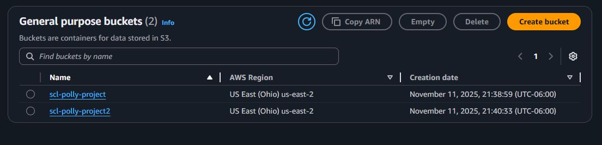
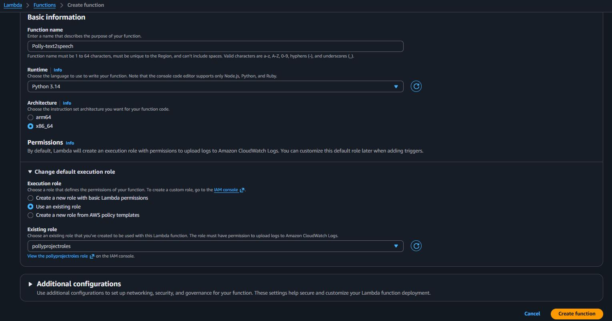

<h1></h1>

<h2>Description</h2>
This project is a serverless text-to-speech system built with AWS. It automatically triggers a Lambda function when something is uploaded to S3. I used Amazon Polly to convert text files into MP3 audio. Once that is complete the  file will be sent to an output folder.
 

<h2>Languages and Utilities Used</h2>

- <b>Python</b> 
- <b>AWS Lambda</b>
- <b>Amazon S3</b>
- <b>Amazon Polly</b>
- <b>Speech Synthesis Markup Language</b>
- <b>S3 Triggers</b>

<h2>🖥️Environments Used💻 </h2>

- <b>Amazon Web Services</b> (21H2)
- <b>AWS Lambda Managed Runtime - Python 3.13</b>
- <b>S3 Standard Storage</b>

<h2>Project walk-through:</h2>

I created two Amazon S3 buckets: one for the Input Text Files and one for Output Audio Files.

<h2>Setup S3 Buckets  </h2>

After this I created an IAM Role to grant the Lambda function only the specific permissions needed: reading S3, writing to S3, and calling the Polly service.
  
<h2>Lambda Setup  </h2>

I created and deployed the Python code to an AWS Lambda function.

<h2>Trigger Setup   </h2>

I configured an S3 Trigger on the Input Bucket. This makes the Lambda function start only when a new file with the .txt suffix is uploaded.

<h2>Text 2 Speech test  </h2>

I uploaded a file named test.txt to the Input Bucket, which automatically started the Lambda function.

The Python code read the text and passed it to Amazon Polly.

Then Polly synthesizes the speech, and generates the .mp3 audio stream.

<h2>Final Outcome  </h2>

The Lambda function saves the .mp3 file to the Output Bucket, where you can download and listen.

<h2>Goal:</h2>
The goal of this project was to create a fully automated, serverless process on AWS that converts text into speech. This project demonstrates my knowledge in connecting cloud services (S3, Lambda, and Polly) to execute an event-driven file conversion pipeline.

